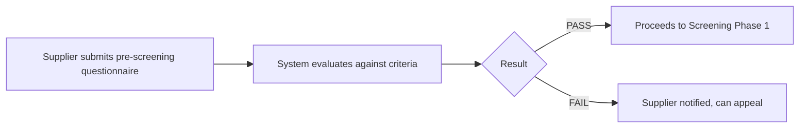
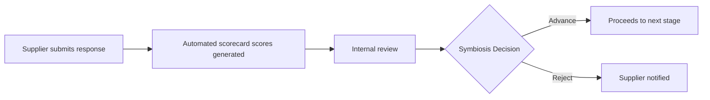

# Symbiosis RFP

<!--
Owner: AntonJ
-->

---

## Overview

This page covers the stages and questions of the RFP process specific to the Symbiosis RFP.

- 27th March - Public launch for ARR and Mangrove developers

---

## RFP Stages

{.compact}
| Stage | Description |
|-------|-------------|
| 1. Pre-Screening | Automating qualification of project eligibility for submitting a proposal for this procurement. Consists of binary criteria. |
| 2. Screening | This stage assesses the project's suitability, implementation, commercial viability and readiness. |
| 3. Geospatial DD | This stage looks at geospatial data to assess the project's carbon model, durability score, baseline, leakage and suitability. |
| 4. Intermediate DD | This stage assesses the project through an intermediate level of due diligence. Additional questions may be requested. |
| 5. Final DD | This stage carries out full due diligence on the project. |

---

## Stage 1: Pre-Screening Check

The pre-screening check is an automated first-stage filter that determines if a project meets basic requirements before proceeding to detailed evaluation.

==- Evaluation Criteria
{.compact}
| Criteria | Rule |
|----------|------|
| Project status | Projects with the following statuses are not accepted: Pre-Feasibility, Verified, Not Active, or Transferred. |
| Project type | Afforestation, Reforestation, and Revegetation (ARR) projects are accepted, including agroforestry. Mangrove restoration projects are accepted. 'Other' project types are not accepted. |
| Project activities | Projects which include afforestation activities are not accepted. All others are accepted. |
| Project country | Countries listed as Level 4 [Link to document] are not accepted for this procurement. |
| Registry | The registry must be approved by ICVCM CCP at the standard level. |
| Methodology | Methodologies and methodology versions that are non-ARR methodology (see excluded list), or not CCP-aligned (see excluded list) are not accepted. |
| Methodology version | Methodologies with versions not CCP-aligned are not accepted. |
| KMLs available | Projects must have a KML for the pilot area and proposed offtake area. |
| Project Design Document (PDD) or Draft PDD | Projects must have a Project Design Document (PDD). |
| Implementation plan | Projects must have an Implementation plan. |
| Carbon model | Projects must have a Carbon model. |
| Financial model | Projects must have a Financial model. |
| Total Project area | The project area associated with the submitted offtake must be a minimum of 2,500 hectares. |
| Do you have a pilot established | A pilot must be established. |
| Please provide pilot size areas for your project, for each project activity specified above | The pilot size area must be at least 2% of the total project area. |
| (ARR only) Using Dynamic baseline | The project must use a dynamic baseline using statistically matched control plots under the selected methodology. |
| Total expected volume for the offtake period | The total expected volume must be at least 100,000 tCO2e. |
| Is the submitting organisation the entity that would be signing an offtake contract? | The organisation making the submission to the RFP must be the organisation who is signing the offtake contract. |
===

==- Questions
{.compact}
| Category | Question |
|----------|------|
| Project Overview | Project name |
| Project Overview | Project status |
| Project Overview | Project type |
| Project Overview | Project activities |
| Project Overview | Project country |
| Project Overview | Is this project active in other countries under the same registry ID? |
| Project Overview | Which other countries is the project active under the same registry ID? |
| Project Overview | Please select the project registry or intended registry |
| Project Overview | What Methodology does/will the project operate under |
| Project Overview | What version of the methodology does/will the project operate under |
| Project Documentation | Do you have KML for the Pilot area and Proposed Offtake area? |
| Project Documentation | Do you have a Project Design Document (PDD) or Draft PDD? |
| Project Documentation | Do you have a Restoration Implementation Plan, including a pilot restoration report? |
| Project Documentation | Do you have a Carbon model for the project? |
| Project Documentation | Do you have a Financial model for the project? |
| Project Details | Total project area |
| Project Details | Do you have a pilot established |
| Project Details | Please provide the size of the pilot area(s) for your project, for each project activity specified above |
| Project Details | Will the project have a dynamic baseline using statistically matched control plots under the selected methodology? |
| Project Details | Will the project have a dynamic baseline using statistically matched control plots under the selected methodology? |
| Project Details | Total expected volume for the offtake period |
| Project Details | Is the submitting organisation the lead project proponent and the counterparty that would be signing an offtake contract? |
===

---

## Stage 2: Screening

This section covers Stage 2: Screening, where you review detailed submissions, scorecard scores, and complete manual review tasks before making advancement decisions.

---

### Stage 2 Overview

Screening Phase 1 is a detailed evaluation using a much larger questionnaire across several different question stages. An automatic scorecard is generated which can then be reviewed and updated as required.

==- Questions
{.compact}
| Category | Question |
|----------|------|
| Project Fundamentals | Project ID as listed in the registry (optional) |
| Project Fundamentals | Does the project require government approval to take place? |
| Project Fundamentals | In what sub-national jurisdiction is your project located? |
| Project Fundamentals | What are the main drivers of degradation? |
| Project Fundamentals | What is the dominant land tenure system of your project region(s)? |
| Project Fundamentals | Have you completed Free Prior Informed Consent (FPIC) for the pilot area(s) and any other immediate area(s) for enrollment? |
| Project Fundamentals | What is your land enrollment strategy? |
| Project Fundamentals | If you are planting exotic species, please confirm they are not listed as invasive in the geographic area of this project under the following datasets: GBIF & CABI. Describe the species the project is looking to plant or use in land restoration, and provide justification for this selection. |
| Project Fundamentals | Please provide justification on the exotic species |
| Project Fundamentals | Will agricultural practices and/or any agricultural output be displaced or modified in the project area upon implementation of project activities? |
| Project Fundamentals | What proportion of potential issuance will be deducted to account for leakage? |
| Project Fundamentals | Explain the process and considerations used to determine the leakage deduction rate. Explain the process and considerations which were followed to arrive at the leakage deduction rate listed above |
| Project Fundamentals | Choose any additional certification(s) and / or eligibility your project has or is in the process of receiving (optional) |
| Project Fundamentals | When did the pilot commence planting and/or restoration? |
| Project Fundamentals | How many hectares have been planted and/or restored in the pilot area? |
| Project Fundamentals | How many trees were planted in the pilot area? |
| Project Fundamentals | Please share the most important lessons learned from the pilot |
| Project Fundamentals | Has the project, thus far, received any pre-issuance ratings or third-party due diligence? |
| Proponent | Add information for the lead project proponent (Organisation name) |
| Proponent | Type of organisation |
| Proponent | How many years of experience does your organisation have? |
| Proponent | Has your organisation developed or implemented any non-carbon restoration projects? |
| Proponent | Please provide details regarding this past experience |
| Proponent | Has your organisation developed or implemented any carbon projects? |
| Proponent | Please provide details regarding this past experience |
| Proponent | Please provide details of your organisation core team members' experience relative to the project |
| Proponent | What is your organisation's source of financial backing for the project being proposed? |
| Proponent | Upload Letter of Intent (optional) |
| Proponent | Please confirm if you can deliver a 10-year offtake agreement |
| Proponent | Has your organisation signed an offtake contract before? |
| Proponent | Are there any other organisation(s) associated with the development and operation of this project? |
| Proponent | Which sector are the organisations involved in the project part of? |
| Proponent | Have any organisations involved in the project received any negative media or press? |
| Proponent | Media article link + Additional comments for rebuttals (optional) |
| Project Documentation | Upload the Project Design Document |
| Project Documentation | Upload the project's Implementation plan |
| Project Documentation | Upload the Letter of Authorisation document |
| Project Boundary | Please upload a single .kml file reflecting completed pilot restoration area; |
| Project Boundary | Please upload a single .kml representing the project area (the area corresponding to the submitted offtake) |
| Project Boundary | Please upload a single .kml for the possible full expansion area over the project lifetime. |
| Pricing offer | Price and volume |
| Pricing offer | Upload any supporting documents (optional) |
| Pricing offer | Total proposed volume during the crediting period |
| Pricing offer | Total price of proposed volume |
| Pricing offer | Average price per credit |
| Pricing offer | Do you wish to include a prepayment in this offer? |
| Pricing offer | Please provide the pre-payment value of credits, pre-payment amount and first disbursement date |
| Pricing offer | Comments (optional) |
| Project Documentation | Upload Carbon model for the project |
| Project Documentation | Upload Financial model for the project |
| Project Documentation | Upload Monitoring, Reporting and Verification (MRV) document |

===

