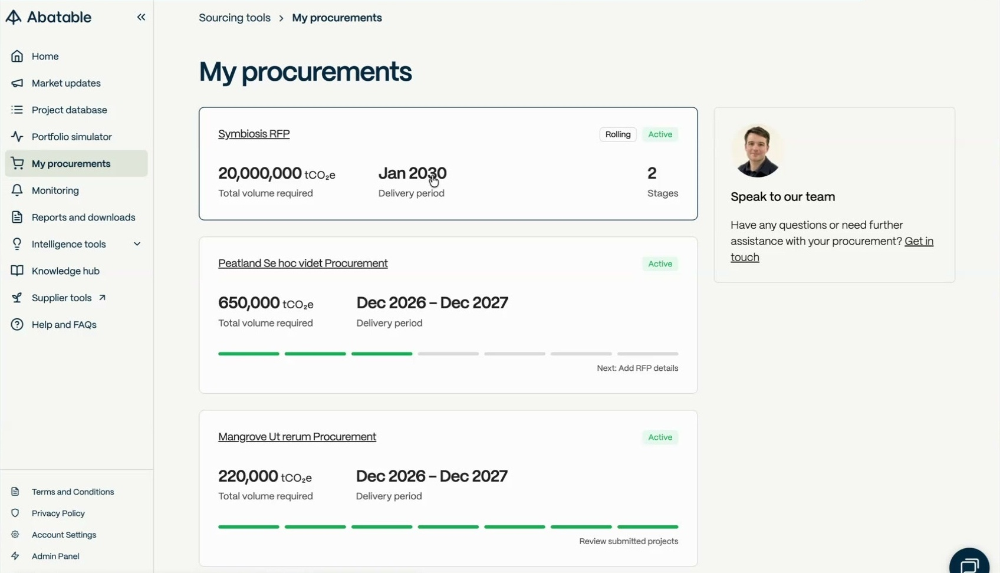
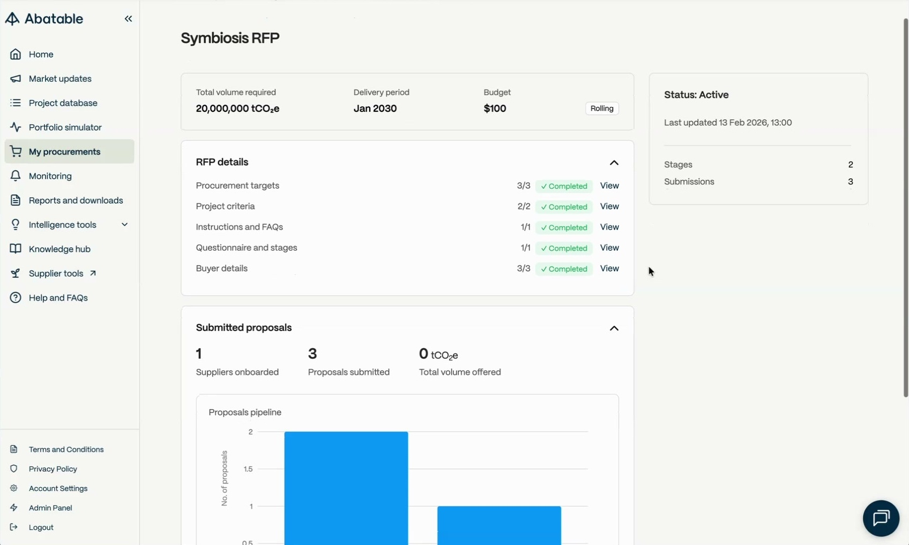
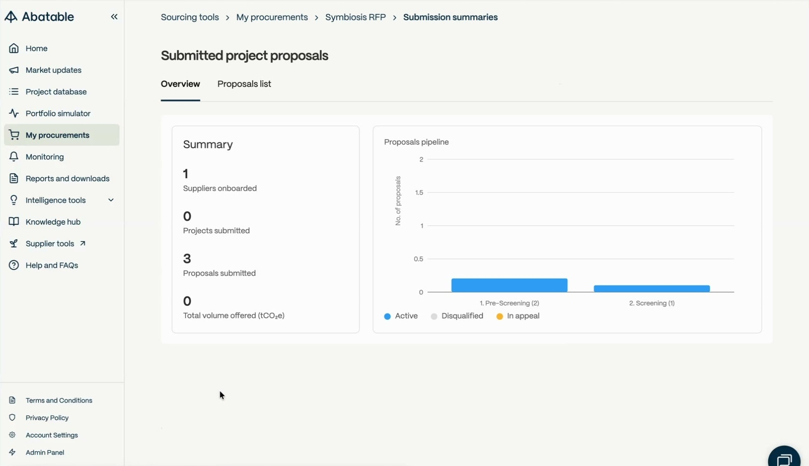
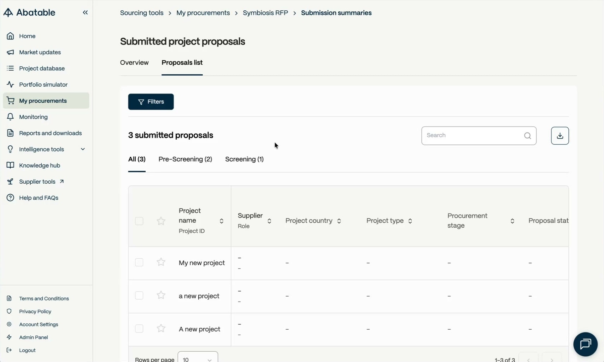
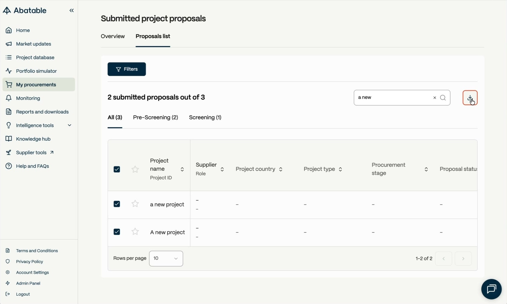

# Viewing Submissions

## Overview

This guide covers how to access and navigate supplier submissions for the Symbiosis RFP, including the RFP summary, submissions overview, proposals list, and data export. For details on the RFP stages and evaluation criteria, see [Symbiosis RFP](01-symbiosis-rfp).

---

## Accessing the Symbiosis RFP

1. Log in at `https://app.abatable.com/`
2. Click **My procurements** in the left-hand navigation
3. Select **Symbiosis RFP** from the list

The **My procurements** page displays each procurement as a card showing the total volume required, delivery period, and number of stages.

---

## RFP Summary

After selecting the Symbiosis RFP, the procurement summary page displays.

### Header

The header shows key procurement parameters:

- **Total volume required** — e.g. 20,000,000 tCO₂e
- **Delivery period** — e.g. Jan 2030
- **Budget**
- **Rolling** badge (indicates the RFP accepts submissions on a rolling basis)

A status sidebar on the right shows the current status, last updated timestamp, number of stages, and total submissions.

### RFP Details

The **RFP details** section is collapsible and shows configuration completeness for:

- Procurement targets
- Project criteria
- Instructions and FAQs
- Questionnaire and stages
- Buyer details

Each row displays a completion count (e.g. 3/3) and a **Completed** badge. Click **'View'** on any row to see its details.

### Submitted Proposals

Below RFP details, the **Submitted proposals** section shows a summary card with:

- **Suppliers onboarded** — number of suppliers registered
- **Proposals submitted** — total proposals received
- **Total volume offered** — aggregate tCO₂e across all proposals

A **Proposals pipeline** bar chart shows the number of proposals at each stage, colour-coded by status.

---

## Submissions Overview

To view the full submissions overview, expand the **Submitted proposals** section and click **'View'**. This opens the **Submitted project proposals** page.

The page has two tabs: **Overview** and **Proposals list**.

### Overview Tab

The **Overview** tab displays:

- **Summary card** with counts for suppliers onboarded, projects submitted, proposals submitted, and total volume offered (tCO₂e)
- **Proposals pipeline** chart showing proposal counts per stage

The pipeline chart uses a colour-coded legend:

| Colour | Status |
|--------|--------|
| Blue | Active |
| Grey | Disqualified |
| Yellow | In appeal |

---

## Proposals List

Click the **Proposals list** tab to view all submissions in a table.

### Stage Tabs

Stage tabs appear above the table to filter proposals by procurement stage:

- **All** — shows every proposal with a total count
- **Pre-Screening** — proposals at the pre-screening stage
- **Screening** — proposals at the screening stage

Each tab displays the number of proposals in brackets (e.g. Pre-Screening (2)).

### Table Columns

The proposals table displays the following columns:

| Column | Description |
|--------|-------------|
| **Project name / Project ID** | The supplier's project name and unique identifier |
| **Supplier / Role** | Submitting organisation and their role |
| **Project country** | Project location |
| **Project type** | e.g. Reforestation, Agroforestry, Mangrove |
| **Procurement stage** | Current stage in the procurement workflow |
| **Proposal status** | Current status of the proposal |

Each column header supports sorting — click the arrows to sort ascending or descending.

### Searching and Filtering

- **Search** — type in the search box (top right) to filter proposals by name. The count updates to show matching results (e.g. "2 submitted proposals out of 3")
- **Filters** — click the **'Filters'** button to apply additional filter criteria

### Favouriting Proposals

Click the star icon next to a project name to mark it as a favourite for quick reference.

### Pagination

Use the **Rows per page** dropdown at the bottom to control how many proposals display per page (default: 10). Navigation arrows allow paging through results.

---

## Exporting Data

To export proposal data as a CSV file:

1. Select proposals using the checkboxes in the leftmost column (or use the header checkbox to select all visible rows)
2. Click the **download icon** (top right, next to the search box)
3. The CSV file downloads to your device

---

## Related Guides

- [Symbiosis RFP](01-symbiosis-rfp) — RFP stages and evaluation criteria
- [Managing Submissions](03-managing-submissions) — Approving, rejecting, and managing proposals
- [Communicating with Suppliers](06-communicating-suppliers) — Requesting information from suppliers
